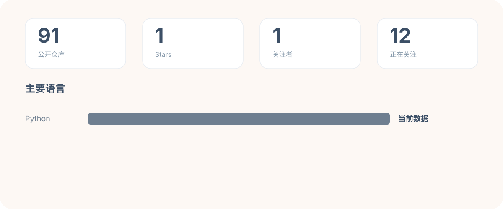
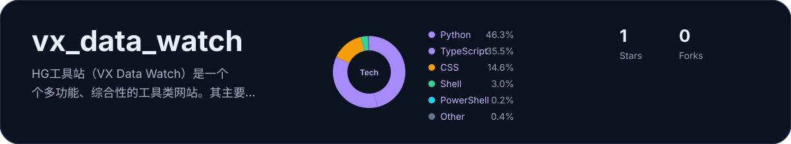

	

## 关于我

你好，我是 **Selina Martin**，一名 C++/Qt 开发程序员。

- 主要方向：C++ / Qt 桌面应用开发
- 擅长：界面开发、业务逻辑封装、跨平台程序设计
- 也在使用：Python，用于脚本、自动化和辅助工具
- 关注：代码结构、可维护性、稳定性和工程实践
- 座右铭：世上无难事，只怕有心人。

## 技术栈

	

| 分类 | 技术 |
| --- | --- |
| 主力语言 | C++ |
| 桌面开发 | Qt |
| 脚本与自动化 | Python |
| 构建工具 | CMake |
| 开发环境 | Linux、VS Code |
| 版本管理 | Git |

## GitHub 概览

	

## 精选项目

	

[vx_data_watch](https://github.com/huizhang556/vx_data_watch) — 我的精选项目，卡片数据由 GitHub Actions 自动生成。

## 成就与活动

	

	

- [查看 GitHub 成就](https://github.com/huizhang556?tab=achievements)
- [查看贡献日历](https://github.com/huizhang556)
- [查看项目活动](https://github.com/huizhang556?tab=overview)

	

### 3D 贡献图

	

### 动态贡献贪吃蛇

	

## 联系我

- GitHub：[huizhang556](https://github.com/huizhang556)
- Telegram：[@changfai666](https://t.me/changfai666)
- 交流方向：C++ / Qt / 桌面应用 / Python 自动化

