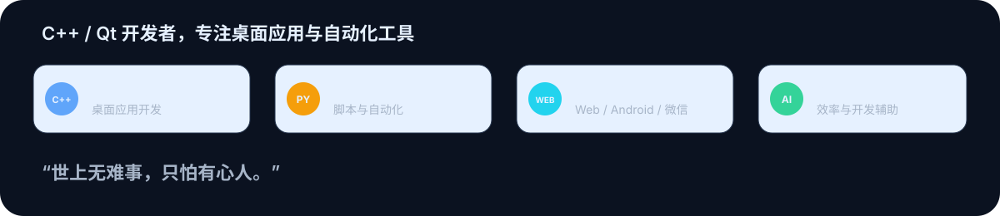

	

	

## 关于我

你好，我是 **Selina Martin**，一名 C++/Qt 开发程序员。

	

## 技术栈

	

## GitHub 概览

	

## 精选项目

	

	

## 个人亮点

	

	

## 贡献活动

### 3D 贡献图

	

### 动态贡献贪吃蛇

	

## 联系我

- GitHub：[huizhang556](https://github.com/huizhang556)
- Telegram：[@changfai666](https://t.me/changfai666)
